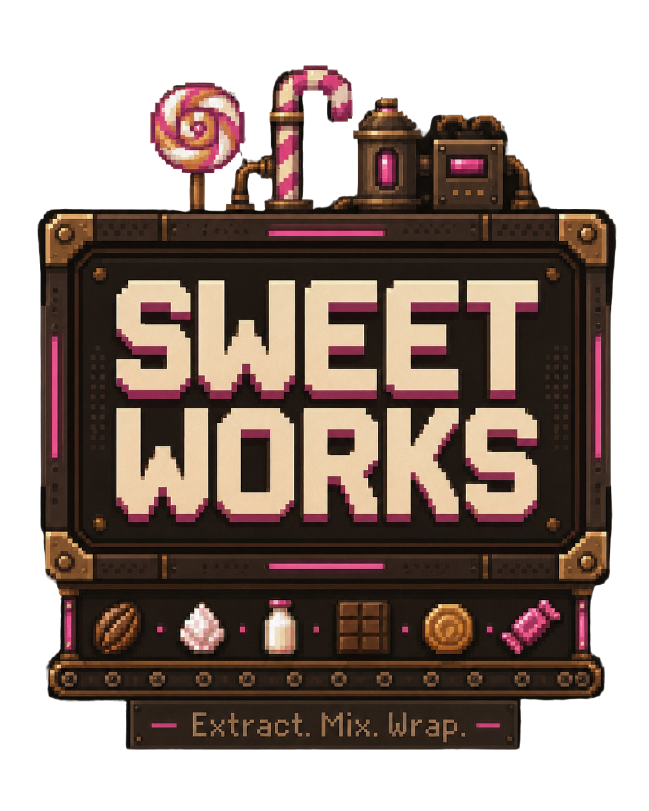

<p align="center">
  
</p>

<h1 align="center">Sweet Works</h1>

<p align="center">
  <em>Extract. Mix. Wrap.</em><br>
  A top-down, pixel-art candy factory in Python &mdash; engineered for
  <strong>1,000,000 items on belts at 20&nbsp;Hz</strong> on a developer laptop.
</p>

<p align="center">
  <a href="#run">Run</a> &middot;
  <a href="#controls">Controls</a> &middot;
  <a href="#benchmarking">Benchmarking</a> &middot;
  <a href="#architecture-notes">Architecture</a> &middot;
  <a href="#folder-map">Layout</a>
</p>

---

## What's in the box

- **Confectionery item chain** &mdash; cocoa beans become chocolate, sugar
  crystals + milk become caramel, and chocolate + caramel get wrapped into
  finished candy bars (`src/items/registry.py`,
  `src/buildings/registry.py`).
- **Six placeable structures** with full 90&deg; rotation + perpendicular
  mirror &mdash; cocoa & sugar extractors, a milk well, a chocolate mixer,
  a caramel pot, and a candy wrapper.
- **Procedural pixel-art sprite generator** (`src/assets/sprites/`)
  that bakes a tile/item-sized PNG cache on first launch, plus a
  hot-reloadable Sprite Studio (**F4**) for live re-authoring.
- **Centralised design system** &mdash; a frozen `PALETTE` (warm
  cocoa-dark backgrounds, candy-pink/mint/pistachio accents),
  `THEME` (spacing, radii, animation easings), and `TYPE` (Silkscreen
  for display, Jersey&nbsp;10 for UI). Every panel, tooltip, button, and
  HUD widget reaches for the same tokens.
- **Sleek shared animation primitives** &mdash; `Tween` and `AnimValue`
  in `src/rendering/animation.py` drive every fade, slide, hover lift,
  reveal stagger, sprinkle parallax, and panel slide-in.
- **Data-oriented belt sim** &mdash; `BeltChainsSoA` packs every chain into
  contiguous `int16` NumPy arrays. One simulation tick is three
  vectorised operations across the entire world.
- **Chunked rendering** &mdash; floor + belt backgrounds bake per
  16&times;16 chunk per zoom bin, only dirty chunks re-bake, and animated
  belts/items stream through `surface.blits` in one call per chain.
- **Fixed-timestep simulation** &mdash; the sim ticks at 20&nbsp;Hz; the
  renderer interpolates with `prev_slots` / `prev_offset` at 60&nbsp;FPS
  for buttery-smooth motion.
- **Research tree** (**TAB**) &mdash; a pan/zoom board of unlockable nodes
  with animated connectors and a slide-in detail menu, gating buildings
  and tuning knobs (extractor speed, assembler speed, port capacity,
  belt throughput).
- **Objectives + Stats** (**J**) &mdash; a live `StatsTracker` ring
  buffer feeds an `ObjectivesState` catalog of prereq-chained tiers
  (gather &rarr; craft &rarr; scale &rarr; master), surfaced in a
  right-docked window with Objectives / Items / Buildings / Session
  tabs.
- **Settings scene** &mdash; in-game display, simulation, audio, and
  camera tuning with live preview, persisted to
  `assets/user_settings.json`.
- **Audio cue system** &mdash; semantic cues (`ui.click`, `world.place`,
  &hellip;) with throttling, pitch variants, and per-group toggles.
  Fails soft on headless / no-audio boxes so tests and benchmarks pay
  nothing.
- **Three perf harnesses** sharing one set of gates: an in-game
  benchmark scene, a headless `python -m bench` CLI, and a
  `pytest-benchmark` suite wired to CI.

## Run

```bash
python -m pip install -r requirements.txt
python main.py
```

First launch will:

1. Download two Google Fonts into `assets/fonts/` (one-time, requires
   internet).
2. Bake every procedural sprite into `assets/sprites/t<TILE>_i<ITEM>/`
   from the live palette.

If you'd rather pre-populate fonts, drop these `.ttf` files into
`assets/fonts/`:

- `Silkscreen-Regular.ttf` (SIL OFL 1.1)
- `Jersey10-Regular.ttf` (SIL OFL 1.1)

## Controls

### Title screen

| Key                  | Effect                                  |
| -------------------- | --------------------------------------- |
| Up / Down, W / S     | Move selection                          |
| Enter / Space / Click| Activate selection                      |
| **P**                | Quick-launch the play scene             |
| **B**                | Quick-launch the 1M-item benchmark      |
| Esc                  | Quit                                    |

### In-game

| Key / Action                     | Effect                                          |
| -------------------------------- | ----------------------------------------------- |
| WASD / Arrows                    | Pan camera                                      |
| Middle-mouse drag                | Pan camera (1:1, with release inertia)          |
| Scroll wheel                     | Zoom (camera-anchored at cursor)                |
| **Q**                            | Inspect tool                                    |
| **1**                            | Conveyor belt                                   |
| **2** / **3** / **4**            | Cocoa Extractor / Sugar Extractor / Milk Well   |
| **5** / **6** / **7**            | Chocolate Mixer / Caramel Pot / Candy Wrapper   |
| **R** &middot; Mouse 4 (X1)      | Rotate placement (or rotate building under cursor) |
| **T** &middot; Mouse 5 (X2)      | Mirror placement (flip perpendicular to facing) |
| Left click                       | Place                                           |
| Right click                      | Delete                                          |
| **TAB**                          | Open the research tree                          |
| **J**                            | Toggle the objectives / stats window            |
| **F3**                           | Toggle the live performance HUD                 |
| **F4**                           | Toggle the Sprite Studio                        |
| Esc                              | Back to title                                   |

> **Rotation & mirror.** Every placeable structure is rotatable in 90&deg;
> steps via `R` / Mouse 4. Mirror (`T` / Mouse 5) performs a
> left/right flip across the building's facing axis &mdash; for an
> East-facing chocolate mixer this swaps the input/output rows between
> the top and bottom of its 2&times;2 footprint. Rotation and mirror are
> honoured by port simulation, rendering, the placement ghost, and the
> structure-menu diagram. Pressing the same key while hovering a placed
> building rotates / mirrors that building in place &mdash; items
> buffered on its output port are flushed onto adjacent belts before
> the layout moves.

## Benchmarking

Three complementary harnesses share the same perf budgets defined in
`src/core/config.py`:

### 1. In-game benchmark scene

Press **B** on the title screen (or call
`replace_scene(BenchmarkScene())`). You get a cinematic flyover over a
~1M-item layout, a short warmup, a 15-second measurement window, and a
PASS / FAIL banner keyed off the gates.

### 2. Headless CLI (`make bench`)

```bash
python -m bench                          # 1M items, 600 ticks
python -m bench --items 500000 --ticks 400
python -m bench --json                   # machine-readable output
python -m bench --render                 # also time a headless render pass
```

The CLI uses `SDL_VIDEODRIVER=dummy` and exits **non-zero** the instant
any gate is violated, so it plugs straight into CI.

### 3. pytest-benchmark gates (`make perf`)

```bash
pytest -m bench tests/benchmarks
```

- `test_chain_build_under_gate` &mdash; 1M-item SoA construction
- `test_belt_tick_p95_under_gate` &mdash; 1M-item `SoA.tick` p95 + max
- `test_render_frame_p95_under_gate` &mdash; headless render pass p95

### Perf gates (defaults)

| Metric              | Gate (ms) | Where                       |
| ------------------- | --------- | --------------------------- |
| `belt_tick_p95`     | 20.0      | `GATE_BELT_TICK_P95_MS`     |
| `belt_tick_max`     | 40.0      | `GATE_BELT_TICK_MAX_MS`     |
| `render_frame_p95`  | 16.7      | `GATE_RENDER_FRAME_P95_MS`  |
| `chain_build`       | 500.0     | `GATE_CHAIN_BUILD_MS`       |

## Testing

```bash
make test          # default unit tests (golden traces, topology, objectives, stats)
make perf          # perf-gate benchmarks (slower; bench-marked tests only)
make lint          # ruff
make format        # ruff format
make sprites       # rebuild the procedural sprite cache (forces overwrite)
make icon          # bake assets/branding/icon.{png,ico} from menu_logo.png
```

Or directly:

```bash
pytest                    # unit run (bench-marked tests auto-deselected)
pytest -m bench           # only the perf gates
```

## Folder map

```text
sweet-works/
  main.py
  Makefile
  pyproject.toml
  bench/                  headless CLI benchmark
  tools/                  dev-only scripts (icon baker, contact sheets, ...)
  assets/
    branding/             menu logo + window/app icon (icon.png, icon.ico)
    fonts/                Google Fonts TTFs (downloaded on first launch)
    sounds/               UI / world / sim audio cues (mp3)
    sprites/              procedurally generated PNGs (tile/item-sized cache)
  src/
    core/         game loop, config, clock, input, event bus, perf counters,
                  user settings (load / save / apply)
    design/       palette, typography scale, theme tokens, easing functions
    assets/       asset loader, asset paths, sprite generator package
    audio/        SFX cue catalogue + sound system (pitch variants, throttling)
    world/        grid (dirty chunks), tile, camera, direction, world
    items/        item types + registry + int16 SoA item ids + pool
    belts/        ConveyorBelt tile, BeltChainsSoA, topology builder
    buildings/    Port (ring buffer), building base, miner, assembler, registry
    rendering/    chunk renderer, scaled-sprite cache, cull, surface pool,
                  layers, renderer, tween/animation, pixel helpers
    research/     research nodes, tree, state, info renderer
    stats/        StatsTracker, ObjectivesState + catalog
    ui/           widget, HUD, toolbar, placement cursor, perf HUD,
                  sprite studio, objectives window, structure menu,
                  research menu, controls, drag-pan, info, tooltip
    scenes/       scene base, menu, play, settings, research, benchmark
  tests/
    conftest.py
    test_belt_sim.py             golden traces for SoA tick
    test_topology.py             chain merge / successor / port tests
    test_direction_transforms.py rotation + mirror invariants
    test_research_state.py       research lock / unlock / effect application
    test_stats_tracker.py        rolling-window throughput math
    test_objectives.py           catalog evaluation, prereq chaining
    test_objectives_window_smoke.py  UI smoke render
    test_structure_menu_layout.py    structure menu layout golden
    test_info.py                 inspector text rendering
    benchmarks/
      test_perf_gates.py         pytest-benchmark perf gates
```

## Architecture notes

- **Struct-of-arrays belt sim.** A belt chain is a maximal linear run of
  belts. All chains share four NumPy arrays (`slots`, `chain_offset`,
  `boundary_mask`, topology). One tick =
  `(propagation) -> (tail exits) -> (render snapshot)`, each a single
  vectorised write across every slot.
- **Sim/render decoupling.** `clock.dt` drives the render loop; the
  simulator always steps at fixed 20&nbsp;Hz. Items are drawn at
  `slots + sim_alpha * prev_offset`, so the 60&nbsp;FPS render sees
  smooth motion even though the sim only moves items at 20 discrete
  steps per second.
- **Allocation discipline.** Hot paths allocate nothing: `Port` is a
  NumPy ring buffer, `ItemType` ids are `int16`, the event bus defers
  handler removals, and UI overlays reuse surfaces from `SurfacePool`
  via the `acquired(...)` context manager.
- **Rendering budget.** Floor + belt backgrounds are baked per
  `CHUNK_SIZE` (16&times;16) chunk per zoom bin. Only dirty chunks
  re-bake. Animated belts and items are culled per-chain and drawn via
  `surface.blits` in a single call per chain.
- **Shared UI idioms.** Every menu, panel, tooltip, and dock builds on
  the same primitives: `beveled_panel` + `gradient_fill` from
  `src/rendering/pixel.py`, `Tween` / `AnimValue` from
  `src/rendering/animation.py`, `Widget` hover/press lerps from
  `src/ui/widget.py`, and `_Hit` dispatch on rectangles. Adding a new
  panel mostly means picking the right tokens, not reinventing the
  rendering or interaction layer.

## Research tree

`src/research/tree.py` declares a 5-row research grid banded by
category &mdash; Extraction roots, Extraction modifiers, Processing
unlocks, Processing modifier + Packaging, and Logistics. Starting
buildings (`extractor_cocoa`, `belt`, `pointer`) are permanently
unlocked; every other building is gated behind exactly one node, so the
toolbar's lock halos react cleanly to the `research.changed` event.

`ResearchState` (`src/research/state.py`) tracks researched ids and
applies modifier stacks (`MINER_SPEED`, `ASSEMBLER_SPEED`,
`PORT_CAPACITY`, `BELT_THROUGHPUT`); `ResearchScene`
(`src/scenes/research_scene.py`) renders a pan/zoom board of node
cards with animated connector edges, a hover tooltip, and a slide-in
detail menu &mdash; visually mirroring the play scene's
building + tooltip + structure-menu triad so everything feels of a
piece.

## Objectives & stats

The play scene owns a single `StatsTracker` (`src/stats/tracker.py`)
that subscribes once to `item.produced`, `item.consumed`,
`building.placed`, and `building.removed`. It keeps per-item
1-second ring buffers over the last hour of history (so every UI
query window fits inside) and surfaces totals, rates, averages,
medians, mins, maxes, peaks, and per-second net series through a
read-only query API. Building counts are mirrored into both
per-prefab and per-class buckets, and a session record samples
belt-tile / building / items-in-world totals once per simulated
second. Both the HUD tooltips and the objectives window read from
that single source of truth.

On top of the tracker, `ObjectivesState` (`src/stats/objectives.py`)
evaluates an immutable catalog of `ObjectiveSpec` entries each
frame &mdash; produce totals, sustained rates over a rolling window,
building-count milestones, belt-tile milestones &mdash; and emits
`objective.completed` on the event bus the first tick a spec crosses
its threshold. The default catalog in `src/stats/catalog.py` chains
tiers via `prereq_ids` so late-game goals stay locked until their
foundations are done.

Press **J** (or click the `OBJECTIVES` pill in the top HUD bar, next
to `RESEARCH`) to open a right-docked, slide-in window with four
tabs &mdash; Objectives, Items, Buildings, Session &mdash; mirroring
the `SpriteStudio` idiom (beveled panels, `Tween` / `AnimValue`
animations, `_Hit` dispatch, `THEME` / `PALETTE` / `TYPE` tokens) so
it feels native to the rest of the UI.

## Audio

`src/audio/sfx.py` exposes a single `SFX` cue catalogue: call sites
play by *intent* (`"ui.click"`, `"world.place"`, `"ui.hover"`,
&hellip;) instead of binding to a file path. Each cue declares its
volume, throttle window, channel group, and a pool of pitch-variant
ratios; pitch variants are baked once at load time by resampling the
source `.mp3` via NumPy. The mixer is pre-initialised with a
256-frame buffer (~6&nbsp;ms latency at 44.1&nbsp;kHz) and 24
channels.

The system fails soft: if `pygame.mixer.init` raises (headless CI,
missing drivers), `is_available` stays `False` and `play` is a
no-op &mdash; so unit tests and benchmarks that build a `World`
without a `Game` pay nothing. Live settings (mute, master/SFX
volumes, per-group toggles) are pulled off `UserSettings` via
`apply_settings`, so changes from the Settings scene take effect on
the next `play` without touching channels mid-flight.

## Settings

`src/scenes/settings_scene.py` is a full-screen scene layered over
the menu's gradient + grid backdrop, with a staggered reveal across
the header, sections, and action bar. Sliders, steppers, toggles,
and section panels (`src/ui/controls.py`) write into a draft
`UserSettings`; pressing **APPLY** hands that draft to
`Game.apply_settings`, which persists it to
`assets/user_settings.json` and mutates live config + clock + display
in place &mdash; no restart required.

## Window/app icon

`assets/branding/icon.png` (256&times;256) and `assets/branding/icon.ico`
(16/32/48/64/128/256 multi-res) are baked from
`assets/branding/menu_logo.png` by `python -m tools.make_icon` (also
exposed as `make icon`). `Game.__init__` loads the PNG and feeds it to
`pygame.display.set_icon`, so the OS window/taskbar shows the candy
logo. The bake is intentionally idempotent: re-run `make icon`
whenever the menu logo changes.

## Fonts / licensing

- **Silkscreen** by Jason Kottke &mdash; SIL Open Font License 1.1
- **Jersey 10** by Sarah Cadigan-Fried &mdash; SIL Open Font License 1.1

Both are permissive. The asset loader fetches them on first launch
into `assets/fonts/`.
